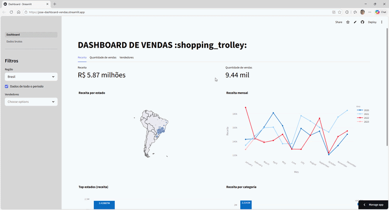

# 📊 Dashboard de Vendas Interativo

[](https://streamlit.io/)
[](https://www.python.org/)
[](https://plotly.com/)
[](https://pandas.pydata.org/)
[](https://jose-dashboard-vendas.streamlit.app/)

> Aplicação interativa desenvolvida com **Python + Streamlit** para análise exploratória de dados de vendas, com filtros dinâmicos e visualizações interativas.

---

## 🚀 Acesse o Dashboard Online

O dashboard pode ser acessado diretamente no navegador:

🔗 https://jose-dashboard-vendas.streamlit.app/

---

# 🎥 Demonstração do Dashboard



Este GIF demonstra a navegação pelo dashboard, aplicação de filtros e visualização dinâmica dos dados.

# ✨ Funcionalidades

## 📈 Dashboard de Análise

O dashboard principal apresenta visualizações interativas para análise de vendas.

Principais análises disponíveis:

- 📍 **Mapa de Receita por Estado**  
Visualização geográfica das vendas no Brasil.

- 📅 **Receita ao Longo do Tempo**  
Análise temporal das vendas permitindo identificar tendências.

- 🏆 **Top Estados por Receita**  
Ranking dos estados com maior volume de vendas.

- 🛍 **Receita por Categoria de Produto**  
Comparação entre categorias de produtos.

- 👨‍💼 **Performance de Vendedores**
  - Top vendedores por faturamento
  - Top vendedores por quantidade de vendas

---

## 🧾 Página de Dados Brutos

Página dedicada para exploração detalhada dos dados e exportação.

Filtros disponíveis:

- Nome do produto
- Categoria do produto
- Faixa de preço
- Frete
- Período da venda
- Vendedor
- Estado da compra
- Avaliação do cliente
- Tipo de pagamento
- Quantidade de parcelas

Recursos adicionais:

- 📊 Seleção dinâmica de colunas
- 📥 Download dos dados filtrados em CSV
- 🔍 Contagem automática de linhas filtradas
- ⚡ Atualização em tempo real dos filtros

---

# 🎛️ Filtros Globais

O dashboard permite filtros que afetam todas as visualizações:

- Região do Brasil
- Ano da venda
- Vendedor específico

Esses filtros permitem análises comparativas rápidas.

---

# 🚀 Como Executar Localmente

## Pré-requisitos

- Python 3.8 ou superior
- pip

---

## 1️⃣ Clonar o repositório

git clone https://github.com/zfaria/dashboard_vendas.git
cd dashboard_vendas

2️⃣ Criar ambiente virtual (recomendado)

Windows
```
python -m venv venv
venv\Scripts\activate
```

Linux / Mac
```
python3 -m venv venv
source venv/bin/activate
```

3️⃣ Instalar dependências
```
pip install -r requirements.txt
```

4️⃣ Executar o projeto
```
streamlit run Dashboard.py
```

Abra no navegador:

http://localhost:8501

## 📁 Estrutura do Projeto
```
dashboard_vendas/
│
├── assets/
│ └── dashboard_demo.gif
│
├── .streamlit/
│ └── config.toml
│
├── pages/
│ └── Dados_brutos.py
│
├── Dashboard.py
├── requirements.txt
└── README.md
```
📊 Sobre os Dados

Os dados são consumidos através da API pública:

https://labdados.com/produtos

Informações disponíveis incluem:

- Produto
- Preço
- Frete
- Data da compra
- Vendedor
- Localização geográfica
- Avaliação do cliente
- Tipo de pagamento
- Parcelamento

Esses dados representam transações de e-commerce no Brasil no perído de 2020 à 2023.

🛠️ Tecnologias Utilizadas
- Python
- Streamlit
- Pandas
- Plotly
- Requests

🎯 Destaques Técnicos
- Dashboard interativo desenvolvido 100% em Python
- Visualizações dinâmicas com Plotly
- Estrutura multipágina do Streamlit
- Sistema de filtros para análise exploratória de dados
- Exportação de dados filtrados

👨‍💻 Autor

José Faria Neto

GitHub
https://github.com/zfaria
https://zfaria.github.io/

LinkedIn
https://www.linkedin.com/in/jos%C3%A9-faria-a8b262180/

E-mail
jose.neto26@hotmail.com

💡 Aprendizados

Durante o desenvolvimento deste projeto foram praticados:

- Construção de dashboards interativos com Streamlit
- Manipulação de dados com Pandas
- Visualização de dados com Plotly
- Consumo de APIs com Python
- Estruturação de projetos de análise de dados
